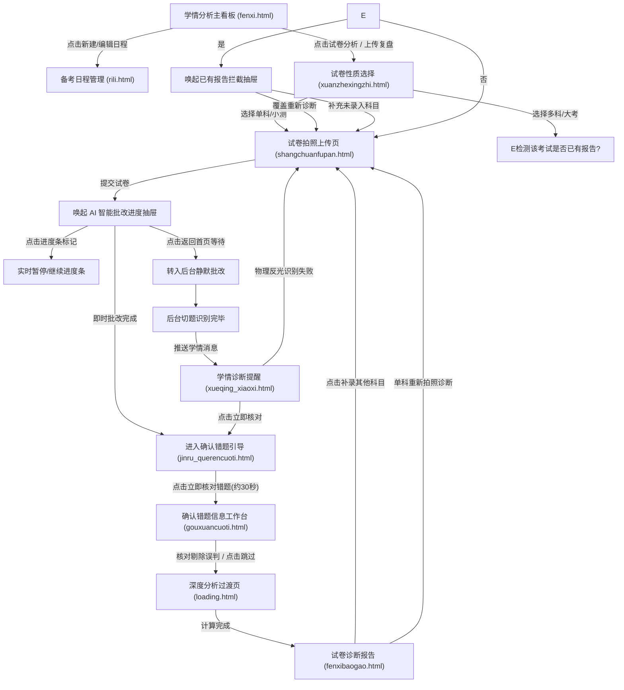

# 小苗伴学 · 9月版本 PRD 完整归档规范文档 (产品需求与原型设计)

> **线上原型演示总控 (PRD Hub)**: [https://tangyun.abrdns.com/](https://tangyun.abrdns.com/#page=fenxi)  
> **归档版本**: `V2.0 (9月迭代稳定版)`  
> **归档时间**: `2026-09-18 17:50:47`  
> **项目工程**: `9月版本 / yuanx_9`  
> **覆盖平台**: 移动端 H5 / App 内嵌 Webview (标准 375px / 390px 视口规范)

---

## 目录
1. [版本概述与业务背景](#一-版本概述与业务背景)
2. [全局设计规范与架构原则](#二-全局设计规范与架构原则)
3. [核心业务全景流转图](#三-核心业务全景流转图)
4. [全量页面功能与业务规则详细说明](#四-全量页面功能与业务规则详细说明)
   - [P01. 学情分析主看板 (fenxi.html)](#p01-学情分析主看板-fenxihtml)
   - [P02. 备考日程管理 (rili.html)](#p02-备考日程管理-rilihtml)
   - [P03. 试卷性质选择与拦截 (xuanzhexingzhi.html)](#p03-试卷性质选择与拦截-xuanzhexingzhihtml)
   - [P04. 试卷拍照与AI批改 (shangchuanfupan.html)](#p04-试卷拍照与ai批改-shangchuanfupanhtml)
   - [P05. 确认错题引导中转抽屉 (jinru_querencuoti.html)](#p05-确认错题引导中转抽屉-jinru_querencuotihtml)
   - [P06. 错题勾选核对工作台 (gouxuancuoti.html)](#p06-错题勾选核对工作台-gouxuancuotihtml)
   - [P07. 深度学情计算过渡页 (loading.html)](#p07-深度学情计算过渡页-loadinghtml)
   - [P08. 试卷诊断分析报告 (fenxibaogao.html)](#p08-试卷诊断分析报告-fenxibaogaohtml)
   - [P09. 学情诊断提醒消息流 (xueqing_xiaoxi.html)](#p09-学情诊断提醒消息流-xueqing_xiaoxihtml)
5. [多考生家庭隔离与数据防呆机制](#五-多考生家庭隔离与数据防呆机制)
6. [异常处理与容错规则汇总](#六-异常处理与容错规则汇总)

---

## 一. 版本概述与业务背景

### 1.1 业务背景与痛点
1. **认知断层痛点**：用户上传试卷后，原系统直接由切题跳往分析报告，导致用户不知道系统圈出的错题是否精准；或者在后台静默批改时，用户以为已经出报告，实际上处于待核对状态。
2. **多科大考木桶效应**：期中、期末、月考等大型考试涉及语文、数学、英语、物理等多门科目。原有逻辑要求全科上传且全科成功才能核对，导致任一科目卡住（如拍照反光）全流程停滞。
3. **多考生家庭隔离缺失**：针对多孩家庭，既需要按考生分别建立独立的学情档案与考试复盘，又需要在全家日程中总览各考生的备考节点。
4. **日程与考前复盘脱节**：日程仅充当备忘录，未与学情分析系统中的历史错题和考前查漏补缺联动。

### 1.2 本期核心交付目标
- **流水线式错题核对**：引入「进入确认错题中转抽屉」+「30秒极速勾选错题工作台」，将核对动作前置并解耦。
- **异步部分就绪体验**：多科上传支持“部分科目就绪先行核对”，失败科目独立告警重传。
- **大考已有报告拦截防呆**：同一考试再次录入时，智能识别已有报告，提供“覆盖重传”与“补录未上传科目”双通道。
- **全局消息触达闭环**：在学情消息中心建立完整的卡片生命周期追踪。

---

## 二. 全局设计规范与架构原则

1. **视口与布局标准**：
   - 移动端基于标准 375×812 / 390×844 设备画板设计，左右安全边距 16px，卡片圆角 12px~16px。
   - 悬浮底部操作栏（Bottom Fixed Dock）统一采用 16px 安全垫底与纯白毛玻璃/卡片投影。
2. **交互色彩系统**：
   - **品牌主色**：`#3388FF`（科技蓝，用于主按钮、导航激活高亮）
   - **正向成功/就绪**：`#10B981` / `#05FFD5`（用于已就绪状态、正确题标记）
   - **异常警示/待核对**：`#F59E0B`（用于疑难错题、待核对提示、修改标注）
   - **错误/失败/危险**：`#EF4444`（用于解析失败、删除警示、下线功能）
   - **中性灰底与分割线**：背景 `#F8FAFC`，分割线 `#E2E8F0`，次要字体 `#64748B`。
3. **ProtoHub 跨端互通机制**：
   - 全局通过 `safeProtoNavigate(...)` 统一调度路由，支持 URL 参数与 `localStorage` 上下文无缝共享。

---

## 三. 核心业务全景流转图

---

## 四. 全量页面功能与业务规则详细说明

### P01. 学情分析主看板 (`fenxi.html`)

- **线上路由**: `#page=fenxi` （[点击直接访问在线原型](https://tangyun.abrdns.com/#page=fenxi)）
- **功能所属分类**: 1. 核心看板与数据总览
- **业务定位**: 多考生学情总览、近期大考与小测看板、弱项知识点分布与快捷进入复盘入口。

#### 1. 界面元素与交互逻辑
- **考生档案切换**：支持顶部快速切换多考生身份（如「张小晓 · 高2」、「张二宝 · 初3」），看板卡片与成绩趋势图即时刷新。
- **最新备考看板**：展示距下一次重点考试倒计时天数（如期中考试倒计时 2 天），无日程时展示「添加考试日程」空态卡片。
- **学情雷达与成绩走势**：展示六维学科竞争力雷达模型及月度提分曲线。
- **历史复盘入口**：列表化展示近期模考、小测卡片，点击直跳试卷诊断报告（`fenxibaogao.html`）。

#### 2. 原型标注与业务规则规范 (Annotations)

| 序号 | 类型 | 标注标题 | 关联 DOM 锚点 | 核心业务规则与细节 |
| :--- | :--- | :--- | :--- | :--- |
| **1** | `原有` | **新用户默认日程** | `#app div.esc-light-col` | 当前无任何日程时，展示默认日程：“日程标题"： 建立首个考试日程， “日程类型"： 其它， “关联类型"： 不选 当用户无最近日程，但存在历史日程时暂时原有的”暂无“界面 |

---

### P02. 备考日程管理 (`rili.html`)

- **线上路由**: `#page=rili` （[点击直接访问在线原型](https://tangyun.abrdns.com/#page=rili)）
- **功能所属分类**: 2. 备考排程与日历看板
- **业务定位**: 多考生考试日程统一管理、日历月/周视图切换、考试日程编辑、删除防呆二次确认弹窗、考前复盘清单联动。

#### 1. 界面元素与交互逻辑
- **日历看板视图**：提供月视图与周视图平滑滑动切换，标记各考生大考、模考与随堂测节点。
- **多考生隔离筛选**：支持按孩子多选或单选，确保多孩家庭考试日程一目了然且数据隔离。
- **日程新建与编辑抽屉**：点击日程进入详情面板，提供编辑名称、日期、科目及考生勾选。
- **删除日程二次防呆确认弹窗**：
  - 若删除的日程**已有诊断报告**：弹出强警示确认弹窗，明确提示“已有诊断报告关联，删除将解除该场考试的成绩归档”，防误触。
  - 若为普通待考日程：弹出常规轻量确认。

#### 2. 原型标注与业务规则规范 (Annotations)

| 序号 | 类型 | 标注标题 | 关联 DOM 锚点 | 核心业务规则与细节 |
| :--- | :--- | :--- | :--- | :--- |
| **1** | `原有` | **编辑日程** | `#app div.sheet-card` | 字段 场景 A：所有关联考生均无报告 场景 B：部分或全部关联考生已有报告 说明 日程标题 / 备注 允许修改 允许修改 属于文案展示 日程日期 允许修改 允许修改（同步更新报告时间） 考试日程时间调整也属于常见场景 日程类型 (大考/小测/其他) 允许自由切换 全局锁定不可更改 （点击即 Toast 提示） 报告已生成，防混乱 学生勾选列表 自由勾选/取消勾选 已生成报告的考生置灰锁定（不可取消） 未生成报告的考生可增删勾选 保护已有报告的绑定关系，同时允许增加/移除其他未生成报告的学生 |
| **2** | `原有` | **删除日程说明** | `#app div.modal-card > div:nth-of-type(2) > button:nth-of-type(2)` | 有 分析报告 二次弹窗确认判断逻辑： 检测当前日程下是否至少有 1 位考生已生成考试分析报告。 存在 1 个或多个报告警示弹窗： （“该行程下包含 [学生名] 的考试分析报告，若删除则所有关联的考试报告将一同删除，是否确认删除？”） [ 取消 ] [ 确认删除 ] 无分析报告 二次弹窗确认判断逻辑 ： 弹出普通删除确认（“确认删除该日程？”）。 [ 取消 ] [ 确认删除 ] |

---

### P03. 试卷性质选择与已有报告拦截 (`xuanzhexingzhi.html`)

- **线上路由**: `#page=xuanzhexingzhi` （[点击直接访问在线原型](https://tangyun.abrdns.com/#page=xuanzhexingzhi)）
- **功能所属分类**: 3. 试卷上传与录入准备
- **业务定位**: 区分「多科 / 大考」与「单科 / 小测」，支持已有报告拦截检测与补录未录入科目流转。

#### 1. 界面元素与交互逻辑
- **考试性质双模选择**：
  - **「多科 / 大考」**：适用于期中、期末、模考等全科综合考试，支持多科目打包录入并计算综合总分与竞争力雷达。
  - **「单科 / 小测」**：适用于随堂测验、单元测试，单科极速诊断。
- **已有报告拦截抽屉（核心防呆闭环）**：
  - 用户选定大考名称后，系统检测到该考试已出过报告时，自动滑出底部拦截抽屉。
  - **路径 A · 重新诊断（覆盖）**：废弃旧数据，重新拍照上传该考试。
  - **路径 B · 补录未录入科目**：保留已有科目的成绩，仅针对尚未录入的科目进行定向补充上传。

#### 2. 原型标注与业务规则规范 (Annotations)

| 序号 | 类型 | 标注标题 | 关联 DOM 锚点 | 核心业务规则与细节 |
| :--- | :--- | :--- | :--- | :--- |
| **1** | `原有` | **原入口拦截已有报告日程** | `#app div.intercept-sheet-title` | 拦截弹窗： 弹窗标题：检测到已有考试报告 提示文案：「日期+考试名称」已完成部分/全部科目诊断，您可以直接查看报告，或为未录入的科目补充上传试卷。 操作按钮： 1. 【查看已有报告】：点击后直接跳转至该次考试的报告页。 2. 【补未录入科目】：点击后进入上传试卷页面，仅展示尚未录入的科目。 |
| **2** | `原有` | **多科/单科说明** | `#typeOptionSmall` | 原大小考更名为：「多科 / 大考」与「单科 / 小测」 「多科 / 大考」与「单科 / 小测」可勾选，同新建日程的编辑规则与日程同步更新 |

---

### P04. 试卷拍照与AI批改工作台 (`shangchuanfupan.html`)

- **线上路由**: `#page=shangchuanfupan` （[点击直接访问在线原型](https://tangyun.abrdns.com/#page=shangchuanfupan)）
- **功能所属分类**: 4. 试卷图片采集与后台批改
- **业务定位**: 各科目多张试卷拍照上传、AI 智能批改进度抽屉、切题进度条暂停/标记机制、后台静默批改引导。

#### 1. 界面元素与交互逻辑
- **科目分栏卡片**：横向或竖向展示语、数、英、物等多科试卷采集区，支持拍照、相册多选及角标删除。
- **AI 智能批改进度抽屉与暂停机制**：
  - 点击“开始分析”后唤起底部渐变进度抽屉，展示切题与 OCR 实时流转效果。
  - **交互特色**：点击切题进度条可**实时暂停/继续进度**，支持讲演演示或慢速核验。
  - **后台批改引导**：提供「返回首页等待（后台持续批改）」按钮，点击后试卷转入服务端静默队列，不卡死用户前台界面。

#### 2. 原型标注与业务规则规范 (Annotations)

| 序号 | 类型 | 标注标题 | 关联 DOM 锚点 | 核心业务规则与细节 |
| :--- | :--- | :--- | :--- | :--- |
| **1** | `原有` | **AI批改解析抽屉与后台持续批改** | `#gradingSheetPanel div.gsp-progress-track` | 批改解析中状态与业务交互规则： 解析动画与进度条反馈： 试卷上传后自动拉起半屏抽屉，展示 AI 解析动态光效与实时进度条（点击标注或进度条可随时暂停/恢复，便于演示评审）。 离线/后台批改机制： 用户可随时点击「返回首页等待（后台持续批改）」，系统转入静默后台处理，不阻塞用户其他操作；批改完成后在首页最新日程与通知栏同步推送结果。 自动流转确认： 进度达 100% 后自动平滑流转进入「确认错题」页面（gouxuancuoti.html）。 |

---

### P05. 确认错题引导 (中转抽屉) (`jinru_querencuoti.html`)

- **线上路由**: `#page=jinru_querencuoti` （[点击直接访问在线原型](https://tangyun.abrdns.com/#page=jinru_querencuoti)）
- **功能所属分类**: 5. 错题核对闭环流转
- **业务定位**: AI 切题批改完成后的防断层提示，展示 4 步流转状态条（上传-切题-核对-报告），展示各科错题统计与 30 秒极速核对引导。

#### 1. 界面元素与交互逻辑
- **断层消除核心中转**：针对后台批改完成或前台批改跑完的节点，唤起本引导抽屉，消除用户以为已出报告的认知偏差。
- **步骤指示器可视化**：清晰展示 `[✓ 上传试卷] ➔ [✓ 切题解析] ➔ [● 核对错题] ➔ [○ 学情报告]`，明确告知当前处于第 3 步校验阶段。
- **错题初筛数据摘要**：结构化展示“共发现 18 道错题与疑难点”，并按语文 4 题、数学 6 题、英语 5 题、物理 3 题细分。
- **核心操作**：主按钮「立即核对错题 (约30秒)」，点击直跳错题核对工作台。

#### 2. 原型标注与业务规则规范 (Annotations)

| 序号 | 类型 | 标注标题 | 关联 DOM 锚点 | 核心业务规则与细节 |
| :--- | :--- | :--- | :--- | :--- |
| **1** | `原有` | **立即核对错题说明** | `#app button.btn-sheet-main` | 当试卷识别错题完成（无论是在线即时跑完，还是后台批改完成后，用户在APP中浏览、操作时弹出该弹窗）： 标出 [✓ 1.上传试卷] ➔ [✓ 2.切题解析] ➔ [● 3.核对错题] ➔ [○ 4.学情报告]，让用户知道“当前还没有生成最终报告”，处于校验阶段。 文案：“已初筛勾选题面与批改笔迹，仅需您花费 30 秒 核对剔除误判，即可立即计算学情得分并解锁提分诊断！” 识别错题数量展示： “n道错题与疑难点已圈出”，并按科目拆解（语文 n题、数学 n题、英语 n题、物理 n题），让用户复核。 |

---

### P06. 错题勾选与核对工作台 (`gouxuancuoti.html`)

- **线上路由**: `#page=gouxuancuoti` （[点击直接访问在线原型](https://tangyun.abrdns.com/#page=gouxuancuoti)）
- **功能所属分类**: 6. 错题核对操作工作台
- **业务定位**: 多科目错题 Tab 切换、题面切片与批改笔迹核对、剔除误判题、修改正误状态，结算生成大考总报告。

#### 1. 界面元素与交互逻辑
- **顶部学科快速切换 Tab**：支持多科目 Tab 切换，仅高亮已就绪科目，未就绪科目展示加载中。
- **错题切片核验卡片**：
  - 精确还原试卷切题图片，自动圈出疑难错题（橙色边框），正确题目以浅绿色展示。
  - 单击题目切片可在「错题 / 正确」之间快速翻转切换，剔除 AI 误判。
- **跳过与结算逻辑**：
  - 顶部提供「跳过」按钮，用户赶时间可直接按 AI 预判结果结算。
  - 底部吸底按钮：展示「生成大考诊断报告 (已核对 n 科)」，点击进入深度分析。

#### 2. 原型标注与业务规则规范 (Annotations)

| 序号 | 类型 | 标注标题 | 关联 DOM 锚点 | 核心业务规则与细节 |
| :--- | :--- | :--- | :--- | :--- |
| **1** | `原有` | **跳过说明** | `#app button.btn-header-skip` | 用户可点击跳过错题核对流程 |

---

### P07. 深度学情计算与过渡态 (`loading.html`)

- **线上路由**: `#page=loading` （[点击直接访问在线原型](https://tangyun.abrdns.com/#page=loading)）
- **功能所属分类**: 7. 报告计算过渡态
- **业务定位**: 核对错题后的 AI 算法运算加载动画，展示知识图谱关联、提分空间测算等加载进度动效。

#### 1. 界面元素与交互逻辑
- **分析计算动态展示**：展示“正在生成多维竞争力雷达图”、“正在匹配高频错因知识图谱”、“正在测算提分诊断潜力”等动态微文案。
- **耗时预期**：前端维持 1.5~2.5 秒自然缓冲后自动平滑跳转至最终报告页。

#### 2. 原型标注与业务规则规范
*本页面作为核心流转链路节点，遵循全局数据流与路由规范。*

---

### P08. 试卷学情诊断报告 (`fenxibaogao.html`)

- **线上路由**: `#page=fenxibaogao` （[点击直接访问在线原型](https://tangyun.abrdns.com/#page=fenxibaogao)）
- **功能所属分类**: 8. 学情报告与诊断呈现
- **业务定位**: 多科大考总分与综合雷达图、各单科得分率与薄弱考点、单科重新诊断（拍照反光/模糊重新上传）、补录未录入科目入口。

#### 1. 界面元素与交互逻辑
- **多科综合雷达图**：展示多科总分、年级排位测算以及学科强弱项雷达图。
- **单科下钻卡片**：各科目展示卷面得分、错题列表、薄弱知识点标签。
- **重新诊断（覆盖重传）**：单科卡片右上方提供「重新诊断」按钮，点击带参数跳回上传页定向重传。
- **补录未录入科目**：底部提供「补充未录入科目」入口，直通补充录入模式，解锁完整大考雷达。

#### 2. 原型标注与业务规则规范 (Annotations)

| 序号 | 类型 | 标注标题 | 关联 DOM 锚点 | 核心业务规则与细节 |
| :--- | :--- | :--- | :--- | :--- |
| **1** | `原有` | **重新诊断说明** | `#app button.btn-re-diagnose-pill` | 覆盖与合并规则： 仅允许重新上传该单科的试卷。 诊断完成后，仅覆盖替换该科目的分析数据。 其余科目的保持不变。 |
| **2** | `原有` | **补录科目说明** | `#app div.subj-tab-item.add-tab-btn` | 界面展示规则： 自动过滤并隐藏已完成诊断的科目。 仅展示当前未上传的科目卡片（例如语文、数学已上传，则仅显示英语、物理、化学、生物）。 顶部进度条与统计显示：待补充科目：N 科。 提交规则：提交后，仅对新补充的科目进行分析，完成后自动合并进该次考试。 |

---

### P09. 学情诊断提醒消息流 (`xueqing_xiaoxi.html`)

- **线上路由**: `#page=xueqing_xiaoxi` （[点击直接访问在线原型](https://tangyun.abrdns.com/#page=xueqing_xiaoxi)）
- **功能所属分类**: 9. 消息中心与触达闭环
- **业务定位**: 后台批改并发完成后的双消息分流（错题识别完成·待核对错题 / 错题识别失败·重新拍照）、日程临近提醒、历史报告查看。

#### 1. 界面元素与交互逻辑
- **时间线消息卡片流**：按日期（如 2026年08月27日、08月20日）倒序组织诊断消息。
- **错题识别完成 · 待核对错题卡片**：
  - 文案清晰说明数学、英语已就绪，物理仍在处理中，引导用户先行核对已就绪科目。
  - 底部操作「立即核对 >」，点击直跳确认错题中转抽屉。
- **错题识别失败卡片**：
  - 红色警示标题，明确交代“物理因试卷强光反光或折痕遮挡识别失败”。
  - 底部操作「重新上传 >」，点击直跳物理单科重新拍照上传，单科失败不阻断其他科目。
- **考前复盘与日程临近卡片**：
  - 距离大考 2 天时自动推送考前重点复盘建议，直跳日程页。

#### 2. 原型标注与业务规则规范 (Annotations)

| 序号 | 类型 | 标注标题 | 关联 DOM 锚点 | 核心业务规则与细节 |
| :--- | :--- | :--- | :--- | :--- |
| **1** | `新增` | **错题识别完成·待核对错题提醒** | `#msgCardVerify` | 部分科目错题识别完成先行核对机制： 触发时机： 多科大考并发处理中，数学、英语已率先完成 AI 切题与错题识别（共 11 道错题），物理仍在识别中。 异步解耦价值： 用户无需死等所有科目跑完，可立即点击核对已就绪科目错题（约 30 秒），消除木桶等待焦虑。 操作跳转： 点击「立即核对」进入核对中转弹窗与错题勾选工作台。 |
| **2** | `新增` | **错题识别失败·重新拍照上传提醒** | `#msgCardFailed` | 单科识别异常与独立重拍机制： 触发时机： 物理试卷因强光反光遮挡或折痕导致题干识别失败。 异常隔离： 仅物理单科告警重拍，不影响已识别就绪的数学、英语核对与报告生成。 一键重传： 点击「重新上传」直跳试卷上传页物理重传，无需重新配置其他正常科目。 |

---

## 五. 多考生家庭隔离与数据防呆机制

1. **考生档案唯一标识**：
   - 所有的试卷上传上下文（`uploadContext`）、错题记录、诊断报告及日程，均绑定唯一的 `studentId` 与 `studentName`（如“张小晓 · 高2”）。
   - 在消息中心卡片、核对错题抽屉、诊断报告头部均强透出考生姓名，防止多孩家长发生混淆。
2. **已有诊断报告大考防重复录入**：
   - 相同考生在同一场大考（如“高二上学期期中考试”）下已生成报告时，系统强制拦截，提供“补录未录入科目”或“覆盖重测”，坚决杜绝脏数据重复生成。
3. **日程删除与报告解绑校验**：
   - 当用户在日程中尝试删除一场已有诊断报告的考试时，必须经过二级模态弹窗强警告，告知解除关联影响后方可执行。

---

## 六. 异常处理与容错规则汇总

| 异常场景 | 表现与触发条件 | 系统处理与容错策略 | 对应页面与恢复出口 |
| :--- | :--- | :--- | :--- |
| **试卷强光反光 / 模糊** | 拍照反光遮挡题干，AI OCR 无法精准识别题面 | 判定为「错题识别失败」，触发红色告警消息卡片，说明失败原因（反光/折痕），保留其他正常科目数据 | 消息中心卡片 ➔ 点击「重新上传」直达单科重拍 |
| **多科试卷部分完成** | 语数英物 4 门中，数学英语先跑完，物理耗时较长 | 启动**异步流水线核对机制**，推送「部分科目已就绪」消息，用户可先进去核对数学英语，不等物理 | 点击消息 ➔ [jinru_querencuoti.html](https://tangyun.abrdns.com/#page=jinru_querencuoti) |
| **大考科目未录全** | 期中考仅上传了语数，缺英语物理 | 诊断报告页展示已有科目分析，在雷达图与底部常驻「补录未录入科目」引导，补全后自动合成全科总分 | 诊断报告页 ➔ 点击「补充科目」|
| **误判题面勾选** | AI 笔迹识别将部分正确题目初筛为错题 | 在错题核对工作台中，所有题目均支持单击一键反转，用户 30 秒内即可剔除误判 | [gouxuancuoti.html](https://tangyun.abrdns.com/#page=gouxuancuoti) |
| **用户赶时间跳过核对** | 用户在核对页不愿逐题确认 | 页面右上角常驻「跳过」操作，系统自动采用 AI 默认初筛结果直接生成学情报告 | 点击右上角「跳过」直接进 [loading.html](https://tangyun.abrdns.com/#page=loading) |

---

## 七. 归档结论与在线验证

- **线上演示总入口**: [https://tangyun.abrdns.com/](https://tangyun.abrdns.com/#page=fenxi)
- **代码仓库**: `github.com/tang11012003/bm-show` (Branch: `gh-pages`)
- **独立域名绑定**: `tangyun.abrdns.com` (内嵌根目录 `CNAME` 文件，确保未来任何一次推送均不被覆盖)
- **交付结论**: 本版本已完整贯穿“日程规划 ➔ 试卷采集 ➔ 智能切题 ➔ 错题核验 ➔ 学情诊断 ➔ 消息闭环”全生命周期链路，符合业务验收与工程归档标准。
